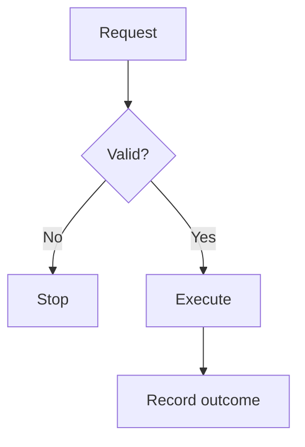

# Practical AI courses

A course directory at `/courses/` and three independent static course websites, published alongside the existing blog:

- `/courses/llm-architectures/`
- `/courses/gpu-kernels/`
- `/courses/agent-harnesses/`

Each course has a Week 1, Day 0 handbook for setup, optional reviews, and administration. Regular days contain substantive implementation, experiments, derivations, or technical analysis. Weekdays are capped at one hour, Saturdays at two hours, and Sundays have no assigned work. Setup and later portfolio work are outside the displayed practical-hour totals and should fit within the learner's available time by extending the calendar as needed.

## Edit and build

The three named source directories own their course configuration, lesson content, schedule, direct resource catalog, and Day 0 organization. Stable checklist IDs are retained from `original-schedule.json`; they do not depend on current calendar positions. `resources.json` records vetted direct URLs, publisher/provenance, verification date, and optional video IDs. `reorganization.json` maps each practical hour to its precise resource focus and reading time.

The directory uses `catalog.json` for its ordered course inventory, short descriptions, and cover filenames. `catalog.py` renders it and `catalog.css` styles it. Titles, links, and practical-hour totals come from each course's configuration and schedule. To add a course, create its source directory using the same schema, place a 3:2 WebP cover in `courses/covers/`, and add an entry to `catalog.json`; no catalog HTML or grid changes are needed. Each course needs a unique track ID for its saved progress. The build produces `courses/index.html` and `courses/catalog.css` alongside the course sites. Commit these generated files as well as sources and covers. `cover-prompts.json` records the built-in image generation prompts and final asset paths for the matching editorial illustrations.

Build prerequisites: Python 3.9+ and Node.js 18+. Python uses only the standard library; the pinned KaTeX renderer is bundled, so rebuilding does not require npm or network access.

From the repository root, run:

```bash
python3 courses/_source/build.py
python3 courses/_source/verify.py
python3 courses/_source/verify-formatting.py
python3 courses/_source/verify-diagrams.py
node courses/_source/verify-client.mjs courses/_source/course.js
```

Commit both the changed sources and generated `courses/<course>/` files. The existing GitHub Pages branch build publishes the generated HTML as static files. No new build service, account, API key, server, or database is required. This directory begins with an underscore so Jekyll excludes build sources from the published website while they remain available in GitHub.

Do not add a root `.nojekyll` file: the existing blog still uses Jekyll. The course HTML has no front matter and is copied without a template. Existing blog files and settings are unchanged.

## Technical text formatting

All lesson prose, plans, checklists, resources, and handbook sections support inline code with backticks, **bold text**, and Markdown links. Multi-paragraph fields also support numbered/bulleted lists, tables, fenced code blocks, and display math. Use formatting to clarify technical notation; keep ordinary prose unformatted.

- Inline math: `\(QK^\top/\sqrt{D}\)`.
- Display math: put `\[` and `\]` on their own lines, with the LaTeX expression between them. `$$` display delimiters and symbolic `$x^2$` inline math are also accepted. Prefer `\(...\)` for unambiguous math; currency such as `A$300` remains ordinary text.
- Code blocks: put three backticks plus a language (`python`, `bash`, `cuda`, `json`, or `text`) on an opening line; close with three backticks on another line. Indentation, newlines, and literal angle brackets are preserved. The language label is displayed above the block.
- Separate paragraphs and blocks with blank lines. In JSON, use `\n` for newlines and double each LaTeX backslash: `"\\(x^2\\)"` renders inline math.

`formatting.py` escapes raw HTML and renders math at build time with KaTeX 0.18.9. Invalid math and unclosed blocks fail the build. Generated formulas contain both visual HTML and accessible MathML. Only pages with math load the shared local stylesheet; WOFF2 fonts are self-hosted under `/courses/assets/katex/`. There is no browser math runtime or external CDN dependency. Code and display equations scroll horizontally when necessary. The renderer and upstream license live under `vendor/katex/`.

## Teaching diagrams

The three `visuals.json` manifests place 30 targeted figures next to a lesson's key idea or an individual plan step. Flow, branching, and event ordering use Mermaid; matrix masks, geometry, and quantitative plots use precise SVG drawings. Existing work, timeboxes, lesson routes, and progress IDs do not change.

Each entry records a stable figure ID, lesson key, placement (`key-idea` or zero-based `plan-N`), title, detailed accessible description, caption, source path, resource evidence, and technical invariants checked during review. Captions state illustrative assumptions and distinguish analytic curves from measured performance. Do not add a picture that merely repeats a sentence.

Mermaid sources live beside handwritten SVGs in each course's `visuals/` directory. Mermaid code fences are also supported in prose fields. Include `accTitle:` and `accDescr:` in each Mermaid definition, and use the shared `mermaid-config.json`; per-diagram configuration, HTML labels, and click actions are disabled. A compact branching example:

````text

````

`diagrams.py` renders Mermaid at build time and copies SVG assets to `/courses/assets/diagrams/`. Student pages need no Mermaid JavaScript, external service, or CDN. Figures are lazy-loaded, carry text alternatives, scroll horizontally on narrow screens, and link to a full-size vector view. Their layout never scales a narrow diagram beyond its original width.

Checked-in `diagram-cache/` files are keyed by source, Mermaid renderer version, and theme. Existing diagrams rebuild offline without installing the diagram toolchain. New or changed Mermaid sources need Node.js 22.13+ and the pinned npm dependencies:

```bash
cd courses/_source
npm ci
npx puppeteer browsers install chrome
python3 build.py
```

If Chrome is already installed, set `COURSE_CHROME_EXECUTABLE` to its absolute executable path. Container-specific launch arguments can be supplied as a JSON array through `COURSE_CHROME_ARGS`; ordinary desktop builds need neither variable. The browser is used only as a local SVG rendering engine. Mermaid CLI 12.0.0, Mermaid 12.0.0, and Puppeteer 25.12.0 are pinned by the lockfile. Commit new cache files, source diagrams, and generated public assets together.

`verify-diagrams.py` checks every figure's placement, source/cache/public agreement, accessibility metadata, source syntax handling, and asset validity. It also verifies causal-mask cells and exact plotted geometry for cache sizes and Amdahl's law, and recalculates the online-softmax example. Technical review additionally checks residual paths, RoPE, head sharing, LoRA shapes, routing, recurrence arithmetic, budget gates, recovery, context grouping, and evaluation boundaries against the corresponding lessons and sources.

## Progress

Checklists save in localStorage separately for each course. They do not sync between devices automatically. Export/import JSON provides portable backups, with strict course/record validation and timestamp-based merging, including explicit unchecked values. Archived check IDs are retained without contributing to current lesson totals. Storage failures are visible and do not claim a successful save.

No personal progress, credentials, or runtime data is committed. Videos use click-to-load, privacy-enhanced YouTube embeds; their original links remain available if embedding fails. Video alternatives replace the assigned reading block rather than adding homework.

## Verification — 2026-09-30

250 HTML pages, including the course directory; 5,524 local/cross-course links and asset references; 152 practical day pages; 176 one-hour practical steps. Every practical hour has focused verified resources inside its ten-minute reading allocation. The direct catalogs contain 103 distinct URLs and six selected video alternatives. Structural checks, resource coverage, day limits, and eight browser-progress regression scenarios pass. The public build does not run paid API experiments or students' GPU implementations.

The formatting audit checks every generated course page for leaked delimiters, validates local math assets, and confirms that lesson/checklist IDs and URLs still match the previous published version. Renderer checks cover math, literal code, HTML escaping, currency, lists, and tables.
